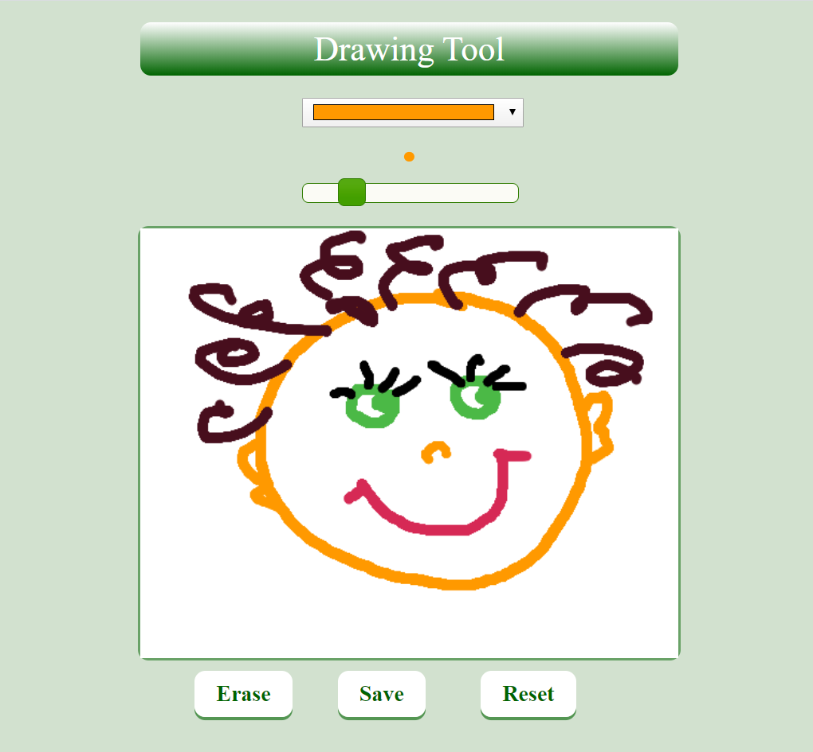
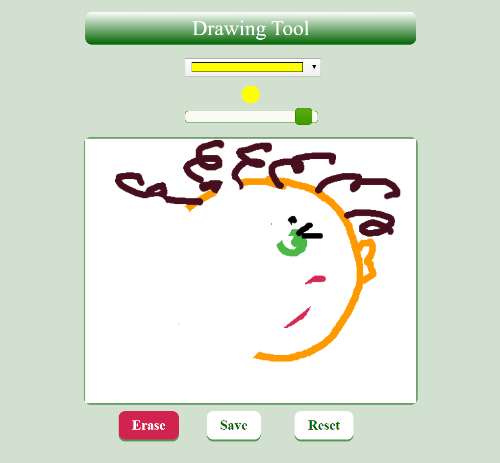
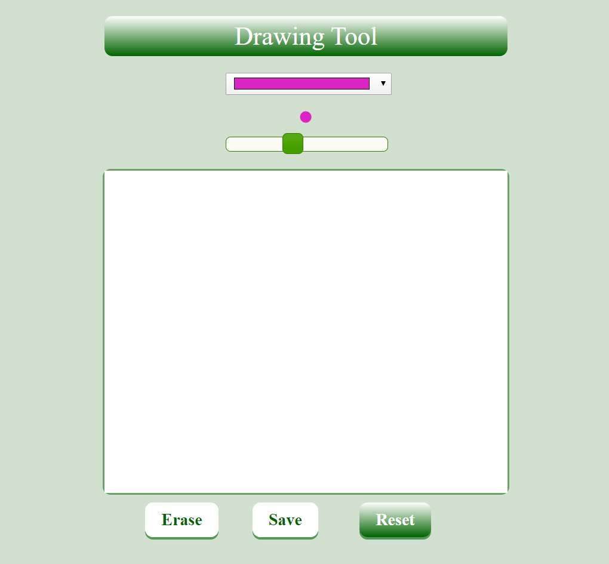
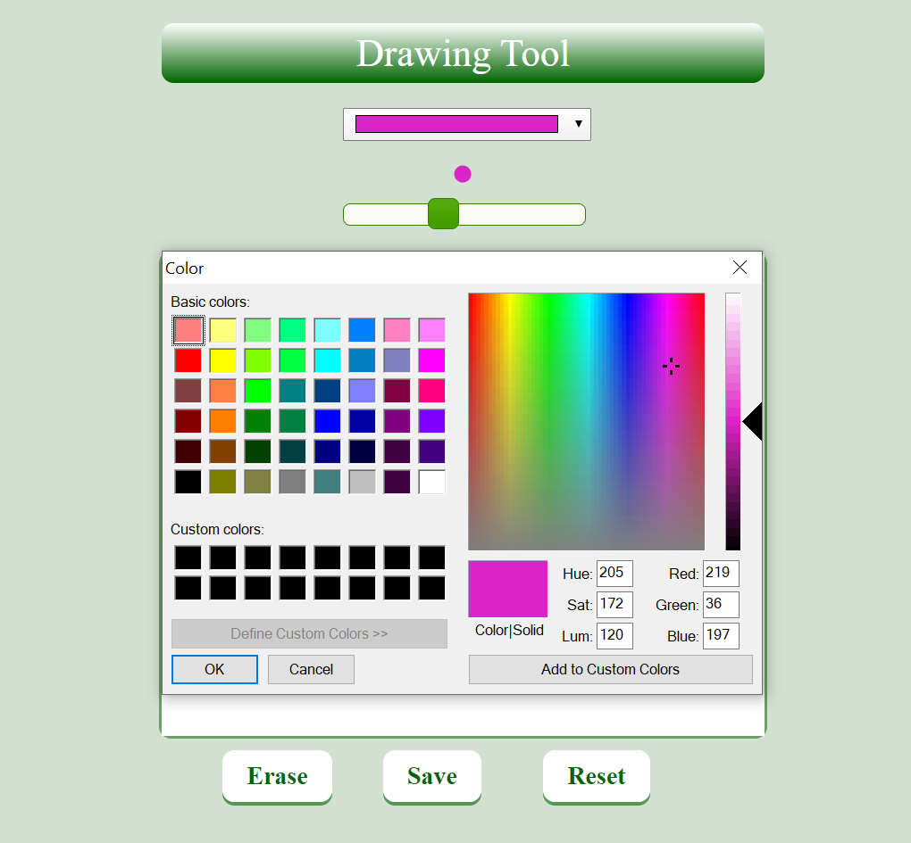

# DrawingGame
Interactive application built with HTML Canvas, JavaScript and jQuery.

<h4>Description</h4>

The main purpose of the project was to build an interactive application - Drawing Game. The game demonstrates programming with HTML Canvas, JavaScript and jQuery.

<h4>Developing Tools:</h4>
<ul>
	<li>HTML Canvas</li>
	<li>CSS3</li>
	<li>JavaScript</li>
	<li>jQuery</li>       
</ul>
<h4>Features:</h4>
<ul>
	<li>The game allows the user to draw on the canvas.</li>
	<li>The user can pick a color from the color picker and change the line width with a slider.</li>
	<li>The erase button allows to erase any spot on the drawing.</li>
	<li>The user can reset the game at any time and start drawing on an empty canvas.</li>
	<li>The user can save the drawing and access it after opening the page again.</li>
</ul>

