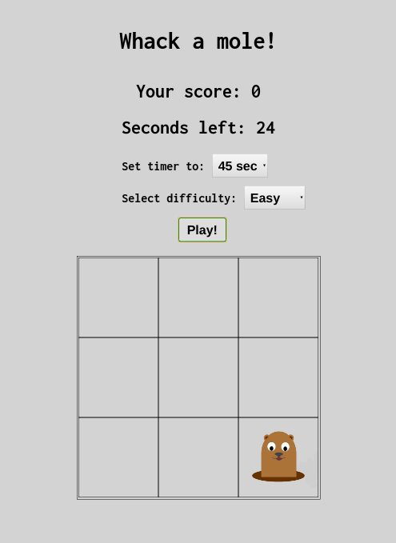

# Whack a mole

A vanilla JavaScript small browser game based on the famous arcade game.

## Brief description

The sneaky little mole is trying to escape from your hammer! The game concept is very easy: you don't know from which hole in the playground the mole is going to show up, will you be faster than her? Will you whack her with your hammer?

_disclaimer_: no real hammer required, just your touchscreen device or mouse pointer :)

In this game there is no winner or loser, it's just a challenge with yourself. Hit the mole as many times as you can before timer reaches 0.

## Main features

- Time selection: choose how many seconds your match will last. The timer can be set to 15, 30, 45 or 60 seconds.

- Difficulty selection: from easy to brutal (really challenging), the difficulty level influences how fast the mole will move.

- Score counter: keep track of how many times you hit the mole. Try to beat your highscore!

An example screenshot of the game:  

## Info and contacts

To run the game all you need is a web browser with JavaScript support. No extra dependency needed, just make sure you have all assets right placed in images folder.

If you have any suggestion/problem/question please email me or open a Github issue.

| Name | Github profile | Email |
|------|----------------|-------|
|Federico Omodei | http://github.com/Fomodei94 | federico.omodei[at]gmail.com

